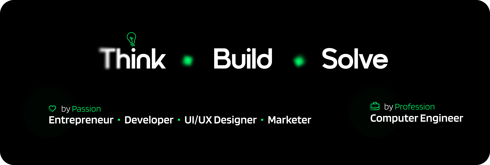

# 💫 About Me:
As a CS undergraduate at United International University, I am a fast learner and thrive in team-oriented environments. My commitment to honesty and hard work drives me to excel in all that I do. I'm passionate about gaining diversified job experience to broaden my horizons and develop new skills. I'm excited to explore new opportunities to contribute meaningfully to cutting-edge technologies and collaborate with diverse colleagues.

 
 
 
 

# 💻 Tech Stack:

# 📊 GitHub Stats:

  
  
  
  
  

